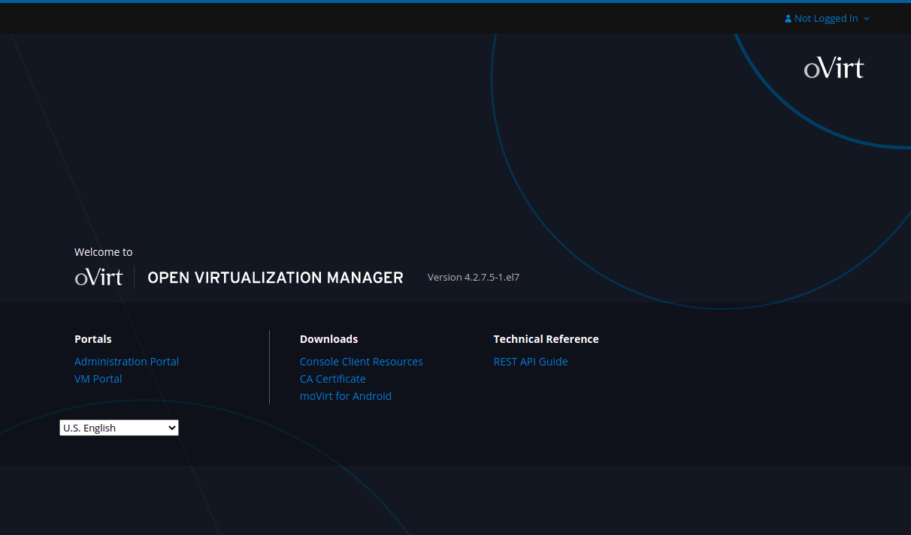
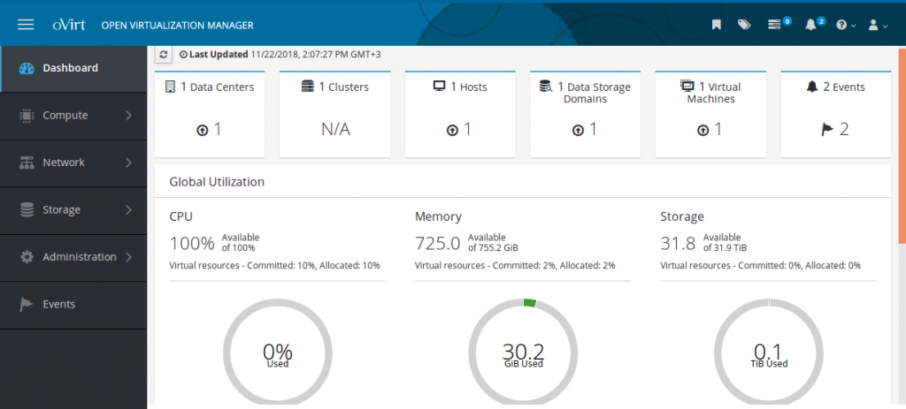

# 

# 

## - Adım Adım oVirt Kurulumu -

Bölüm 1 - [oVirt(RHEV) 4.2 Kurulumu, Yapılandırması ve HOSTED ENGINE Kurulumu](https://www.fatlan.com/07-12-2018-ovirt-rhev-4-2-kurulumu-apilandirmasi-ve-hosted-engine-kurulumu-bolum1/)  

Bölüm 2 - [oVirt(RHEV) 4.2 Kurulum ve Yapılandırması - Host Ekleme](https://www.fatlan.com/21-12-2018-ovirt-rhev-4-2-kurulum-ve-yapilandirmasi-host-ekleme-bolum2/)  

Bölüm 3 - [oVirt/RHEV 4.2 Kurulumu Hostların Power Management Yapılandırması](https://www.fatlan.com/26-12-2018-ovirt-rhev-4-2-kurulumu-hostlarin-powermanagement-yapilandirmasi-bolum3/)  

Bölüm 4 - [oVirt/RHEV 4.2 Kurulumu Hostlara ISCSI LUN Ekleme ](https://www.fatlan.com/01-01-2019-ovirt-rhev-4-2-kurulumu-hostlara-iscsi-lun-ekleme-bolum4/)  

Bölüm 5 - [oVirt/RHEV 4.2 Kurulumu Hostlara NFS Iso/Export Ekleme](https://www.fatlan.com/14-01-2019-ovirt-rhev-4-2-kurulumu-hostlara-nfs-iso-export-ekleme-bolum5/)  

Bölüm 6 - [oVirt/RHEV 4.2 Engine Network(NIC) Infrastructure Ekleme ve Yapılandırma](https://www.fatlan.com/26-01-2019-ovirt-rhev-4-2-engine-network-nic-infrastructure-ekleme-ve-yapilandirma-bolum6/)  

Bölüm 7 - [oVirt/RHEV 4.2 Engine LDAP Yapılandırma](https://www.fatlan.com/19-02-2019-ovirt-rhev-4-2-engine-ldap-yapilandirma-bolum7/)  

Bölüm 8 - [oVirt/RHEV 4.2 Engine SSL Yapılandırma](https://www.fatlan.com/27-02-2019-ovirt-rhev-4-2-engine-ssl-yapilandirma-bolum8/)  

Bölüm 9 - [RestAPI ile Ovirt Backup/Restore Operasyonu](https://www.fatlan.com/08-01-2020-restapi-ile-ovirt-backup-restore/)

-----

### - Ekler -

[Changing the Password for admin@internal](https://www.fatlan.com/30-03-2019-ovirt-admin-pass-change/)

[oVirt Ubuntu16 Guest Agent Kurulumu ve Yapılandırması - Sorun Çözüldü](https://www.fatlan.com/03-04-2019-ovirt-agent-ubuntu16-install/)

[CentOS/Redhat Üzerine oVirt Guest Agent Kurulumu](https://www.fatlan.com/05-04-2019-centos-redhat-uzerine-ovirt-guest-agent-kurulumu/)

[Windows Sanal Makinelere oVirt Guest Agent Driver Kurulumu ve Yapılandırması](https://www.fatlan.com/15-04-2019-windows-sanal-makinelere-ovirt-guest-agent-driver-kurulumu-ve-yap%C4%B1land%C4%B1rmasi/)

[Ovirt RHEV ve Oracle Virtualization Manager’lar için Nested Virtualization(iç içe sanallaştırma) Yapılandırması](https://www.fatlan.com/03-10-2020-ovirt-rhev-ve-oracle-virtualization-managerlar-icin-nested-virtualization/)
